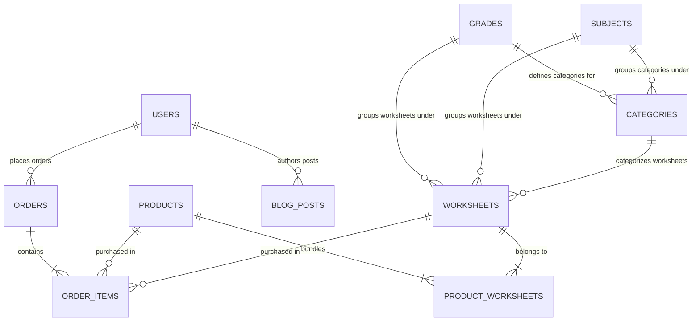

# Entity Relationship Diagrams & Database Relationships

This document describes relationships, primary keys, and foreign keys connecting all 9 tables in the Worksheet Wonder database.

## Entity Relationship (ER) Diagram

## Relationships Details

### 1. Grade-Subject-Category Hierarchy
* **`grades` to `categories` (One-to-Many)**: A grade has multiple categories. `categories.grade_id` references `grades.id`.
* **`subjects` to `categories` (One-to-Many)**: A subject has multiple categories. `categories.subject_id` references `subjects.id`.
* **`categories` to `worksheets` (One-to-Many)**: Each worksheet is associated with exactly one category. `worksheets.category_id` references `categories.id`.
* **`grades`/`subjects` to `worksheets` (One-to-Many)**: To speed up filters, `worksheets` has direct foreign keys `grade_id` and `subject_id`.

### 2. E-Commerce and Transactions
* **`users` to `orders` (One-to-Many)**: A user can place many orders. `orders.user_id` references `users.id`.
* **`orders` to `order_items` (One-to-Many)**: An order consists of one or more purchased line items. `order_items.order_id` references `orders.id` (with Cascade delete).
* **`products` to `order_items` (One-to-Many)**: When a buyer purchases a pre-packaged bundle, it links via `order_items.product_id` referencing `products.id`.
* **`worksheets` to `order_items` (One-to-Many)**: When a buyer purchases an individual worksheet, it links via `order_items.worksheet_id` referencing `worksheets.id`.

### 3. Bundles (Many-to-Many)
* **`products` and `worksheets` via `product_worksheets`**: A product bundle contains multiple worksheets, and a worksheet can be part of multiple product bundles. This is handled by a bridge table:
  * `product_worksheets.product_id` references `products.id`.
  * `product_worksheets.worksheet_id` references `worksheets.id`.

### 4. Blog Publishing
* **`users` to `blog_posts` (One-to-Many)**: A user with `role = 'admin'` or `'teacher'` can author blog posts. `blog_posts.author_id` references `users.id`.
